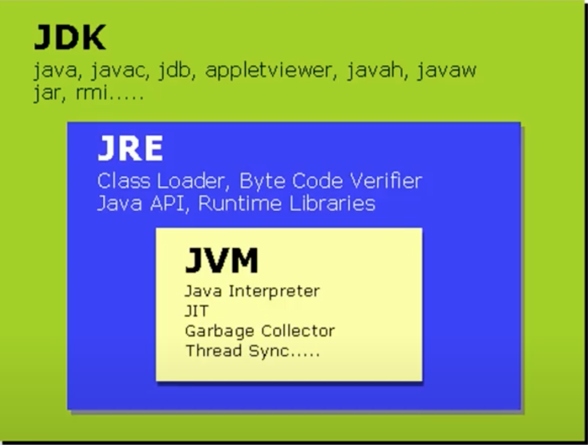

# Java, interviews and bugs

Hi, here are the updates on what I've been studying this week:

### Java stuff

#### Wrapper classes

I knew there was something called boxing and unboxing, which had to be made manually by developers until Java 1.5 when **autoboxing** was introduced. What I didn't understand is why is this "boxing" thing needed.

Well, it turns out that autoboxing consists of converting a primitive type into its **wrapper class.** That is, instead of having an int value, we have an Integer value, an object (reference type). Here is a table of all the primitives and their wrapper classes:

.png>)

#### Diamond syntax

I also learned that since Java 7, there's this thing called diamond syntax which simplifies the manage of generics. With this feature, it is enough to define the type in the reference, so it's not necessary to repeat it in the constructor. This makes it easier to deal with complex types.

Something like: `Set<Integer> mySet= HashSet<>(); // see the <> making a diamond?`

Which takes me to the other thing I learned. How to apply the Dependency Inversion principle of SOLID in Java code. Well, it's just an example. The way the line above is written, allows for easily changing the type of set that needs to be used:

```
Set<Integer> mySet= HashSet<>(); // I made a HashSet
Set<Integer> mySet= TreeSet<>(); // But I needed a TreeSet
Set<Integer> mySet= EnumSet<>(); // But can also use an EnumSet
```

This way, our code relies on interfaces, rather than concrete implementations, making easier to change the code when needed!

.png>)

### Bug's life cycle

This week I started learning a little about testing.



The first visited concept was the bug's life cycle. Honestly, I thought it would be as straight forward as: discover bug, solve it, test it and done. It turns out I was missing some steps and possible results after the testing part. Here's a diagram and explanation of each phase:

.png>)

* **New:** When a new defect is posted for the first time.
* **Assigned:** The lead of the tester approves the bug and assigns the bug to the developer team.
* **Open**: The developer starts analyzing and working on the defect fix.
* **Fixed**: When a developer has made the necessary changes to solve the problem.
* **Test**: Tester retests the code to check whether the defect is fixed or not.
* **Reopened**:  If the bug still exists even after the bug is fixed by the developer, the tester changes the status to “reopened”. The bug goes through the life cycle once again.
* **Duplicate**: When the bug was previously mentioned.
* **Rejected**: If the developer feels that the bug shouldn't be one, developer rejects the bug. This may be caused by things like a misunderstanding of requirements or mistakes in the test environment.
* **Deferred**: This state means the bug is expected to be fixed in next releases (maybe because of the priority of the bug, lack of time for the release or the bug may not have major effect on the software).
* **Closed**: Once the bug is fixed, it is tested by the tester. If the tester feels that the bug no longer exists in the software, tester changes the status of the bug to “**closed**”.

### Cracking the coding interview

These are the key takeaways I got from the book:

* The interviewers may compare your performance with the performance of other candidates for the same position, not with a "expected grade score".
* A numeric score might be assigned to your performance, but it's not actually a quantitative assessment.
* Communication is a key factor: You should do your best to talk out loud throughout the problem and explain your thought process.
* While solving a problem, think about space and time efficiency.
* It's okay if you can’t come up with the optimal solution, but identifying the weak points in your current solution shows your ability to identify problems.
* Preparation for interviews may start years before the actual interview, as we go building our resume (we should focus in getting the right experience!).
* It's not only about the projects we have worked in, but how we talk about them, and the challenges they presented (techniques like _nugget first_ and _S.A.R._ may help).
* &#x20;The problem-solving flow: Listen -> Draw an example -> Brute force -> Optimize -> Walk through -> Implement -> Test.
* You don't need to get every question "right". Performance is a result of factors like, how optimal was the solution, how long it takes the interviewer to get there, how much help they needed, and how clean was the code.


That's all for this week, bye!

