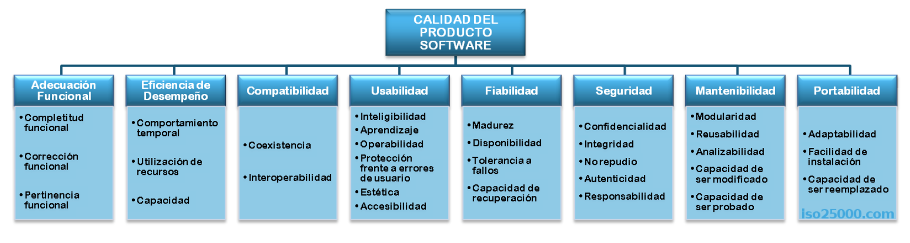

# Testing levels and Generics

This week I learned about these two things mainly:

## Generics

Generics are a way to adding an abstraction level to our code. It separates the algorithms, functions or data structures from the data type used in them, while it helps us not to duplicate code (we can use the same code for creating a stack of strings and a stack of numbers).

However, we have to be careful. When working with generics. When using them, we have no access to functions and methods like .toString() or parseInt(). This happens 'cause generics are intended to work with custom objects and classes rather than primitive types.

Btw, generics look something like this:

```java
// The <T> indicates the generic
public <T> List<T> fromArrayToList(T[] a) {   
    return Arrays.stream(a).collect(Collectors.toList());
}
```

This is a generic method that receives and array of objects and returns them as a list.

The `<T>` at the beginning is necessary even when void is returned, it just indicates that the method will be dealing with generics. If more generic types are going to be used, they should also be listed there.

We can also have **bounded generics**. This is when we indicate that the type _extends_ from a specific class.

```java
public <T extends Number> List<T> fromArrayToList(T[] a) {
    ...
}
```

## Testing types

At first glance, it is very confusing to understand the multiple types of tests and how they are different from each other. This week I found out that, rather than being completely different, tests might complement each other and may be of different types and categories at the same time.

This is so far what I've understood:

* There isn't something like an official list of the types and classification of tests.
* However, there are institutions and norms that give us some guidance.
* The _ISTQB_ (International Software Testing Qualifications Board) defines some types of tests: functional, non-functional, white box testing and change-related tests.
* The ISO/IEC 25010 defines 8 quality characteristics and the type of tests for each one.

### The ISO/IEC

Here's a chart of the characteristics from the official webpage of the ISO 25000:



Each characteristic has its way of testing it:

1\) **Functional suitability**: Does the product satisfy the implicit necessities? -> Functional testing!

2\) **Performance efficiency**: The performance relative to the amount of resources used under specific conditions -> Performance testing (load testing, stress testing, etc.)

3\) **Compatibility**: When you have two or more elements and want to make sure they can coexist in the same environment

4\) **Usability**: How is the product understood, learnt, used and attractive to the user? -> UX testing, accessibility testing

5\) **Reliability**: Honestly, I don't see how this is different form performance efficiency.

6\) **Security**: How much is data and information protected.

7\) **Maintainability**: The ability of the software to be modified (modularity and reusability).

8\) **Portability**: How easily a system o component can be transferred from a hardware/software environment to another one


Not all types of testing apply to every type of system. It all depends on the characteristics of the project and the needs of the business.


### The ISTQB

* **Functional tests**: Measure "what" is done (same as in ISO 25010).
* **Non-functional tests**: Measure "how" should be (quality aspects in ISO 25010).
* **White-box testing**: Based on the inner structure of the system.
* **Change-related testing**: Occur after changes in the code. Whether they are **confirmation tests** (to confirm a defect has been fixed), or **regression tests** (execute the test cases to make sure fixing a bug hasn't changed all the other functionalities). If you ask me, these sound like functional testing tho.

## There's more

Here are another ways of classifying the tests:

### **The way**

Testing may be either manual or automated. In **manual testing**, we got a person in front of the computer trying every possible scenario of whatever they are testing. In **automation testing**, a person previously loaded test cases through code and these conditions/scenarios are run by some software.

### The method

**Black box**: In this kind of testing, the tester has no access to the code. Similar to how a user would interact with the system.

**White box**: The tester can see the code and has access to the logic of the system.

**Gray box**: Tests from both outside and inside the code.

### The level

**Unit testing**: It is often said this is about testing components separately, the thing is, what exactly is a component? A method? A class? Martin Fowler says a component (or unit) is whatever the dev team thinks that makes sense to be a component.

**Integration testing**: It is about the interaction between the components of the system (like the connection between the frontend and the backend).

**System testing**: they focus in the behavior and capacity of the whole system (it is common to apply both functional and non-functional tests).

**Acceptance testing:** they are also about the behavior and capacity of the system, but this tests are run by the final users, and aim for their feedback (this is when "alpha" and "beta" versions of a product come).

## Finally

Also, there are other two types of tests, that some consider ways of testing, rather than a classification or type of tests: **smoky tests** and **sanity tests**.&#x20;

They are pretty alike, since they both consist of first trying a subset of test cases before running all of them. The difference is that in the smoky tests, **all main or basic functionalities of the system are tested**. On the other hand, sanity tests **focus on checking a new functionality or the fix for a defect** so, only test cases related to this part of the code are ran.

Smoky tests would be a way of running functional tests while sanity tests are a way of running regression tests.

I also heard there are other tests called exploration tests which are widely used in agile development for learning more about the component or system in order to write test cases.

## Conclusions

Again, all of these concepts are valid and don't have to negate each other or something like that. You can do unit testing, for a functional requirement, with white box testing, either manual or with automation. At least as far as I know that's how it works.

That's all for this week, bye!
